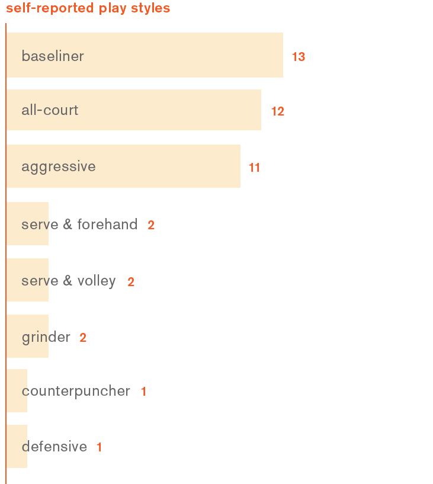
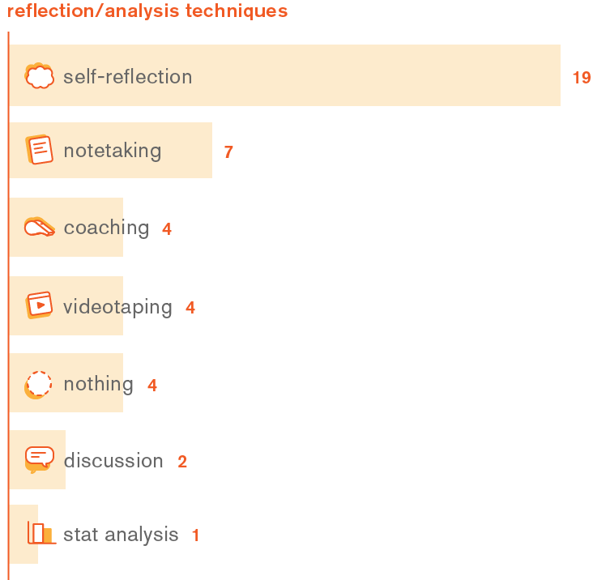

Last week we disappointedly left the Coquitlam Tennis Club with less information than we hoped and many more questions. We needed to find out more before heading back to the court to interview two other groups of interest: “tennis parents” with their children and advanced players. We chose these groups as we predicted they would be especially serious in their tennis development.
  
===

But first, we wanted to know what were players’ general beliefs and attitudes about the tennis competitive scene.

We distributed an online questionnaire to popular forums such as /r/Tennis, Tennis Forums, and Facebook groups. Our understanding was that users of these forums would be more interested in improving their performance than “casual” competitive players (such as our first-round interviewees). The survey included the following questions:
* How would you describe your play style?
* What category(s) do you play?
* How long have you been playing tennis for?
* What is your National Tennis Rating Program (NTRP) rating?
* Do you use any smartphone mobile apps unrelated to calling/messaging?
* What training/coaching activities have you done in the past six months?
* How do you reflect on or analyze your performance after a tennis match?

We uncovered some notable trends from the 50 responses we received:

**The average self-reported [NTRP skill rating](http://assets.usta.com/assets/639/15/National%20tennis%20Rating%20Program.pdf) was 4.3 (between “good” and “very good” consistency, depth and control).**  
It is understood that players with an NTRP rating of 4.5 have a grasp of the nuances of competitive play. The challenge of players at this level becomes mastering play styles and footwork. It appears that players of all skill levels can be willing to actively train to improve themselves, but a player’s ranking is probably connected to their ability to benefit from certain training tools.

**Reported play styles varied widely, but most respondents labelled themselves as either a “baseliner” (30%), “all-court” (27%) or “aggressive” (25%).**  
In tennis, players tend to adopt play styles based on the competitive “metagame”, or current established strategy. Knowing which play styles are popular, why they are popular, and what their defining features are will help us design the tool according to players’ training needs. We plan to find answers to these questions after speaking with coaches and more competitive players.

**45% of respondents claimed they engage in some form of self reflection after a match, while 17% said they do some form of notetaking.**  
These findings suggest a potential need of players to reflect on matches and keep a record of these reflections. We will keep this in mind when ideating features for our product. Our second-round interviews will look into unpacking what types of reflection exercises players engage in, and why they do them. 

**Few respondents (11%) reported using technology such as swing trackers, smartphone apps and videotaping to analyze their stats.**  
“Why not?”, we wondered. Perhaps the tennis technologies available today are just no good, as suggested by Daniele? Or is there an underlying reason that we haven’t yet considered? We hope that our upcoming interviews will give us a better understanding of players’ development journeys.
