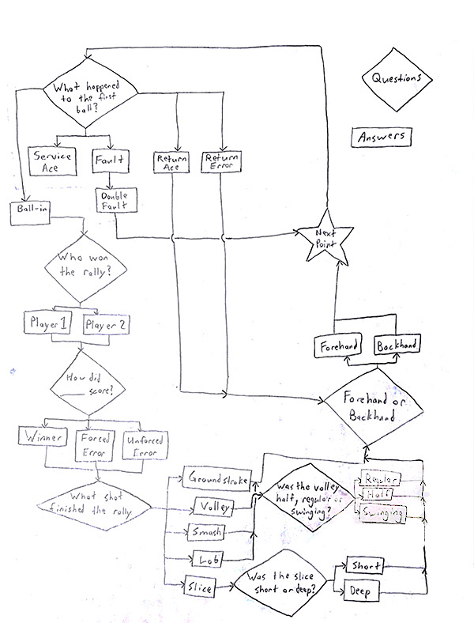
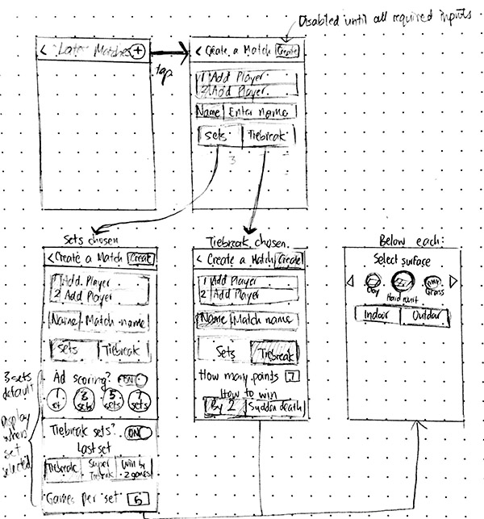
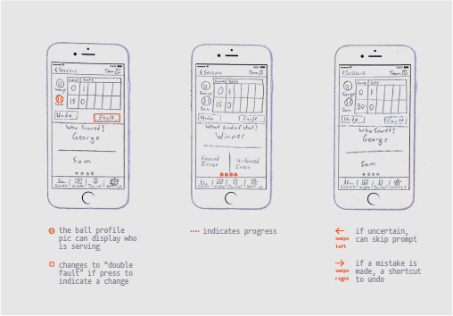
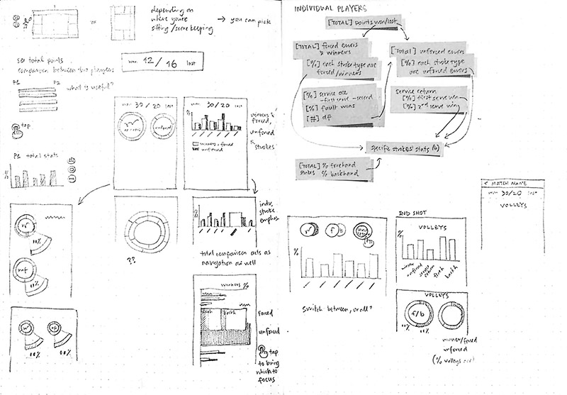

With two months of research and ideation out of the way, it was finally time for us to actually begin designing. The irrefutable need for statistics tracking that came up in our interviews made us prioritize the prototyping of this feature first. 

===

Click on the embedded prototype to explore our first implemented feature, statistics tracking:
<iframe width="362" height="640" src="https://xd.adobe.com/embed/69dd3a4a-6a66-4736-b135-d5d5309e20e1" frameborder="0" allowfullscreen></iframe>

.

  
Current apps show a lack of onboarding (user tutorials) making them difficult to learn and little statistical customization allowing users choose exactly what stats they want to keep track of. One interviewee even indicated that they had created their own app to meet their own statistical fidelity needs. Thus, we began our first Sprint by drafting the flows of typical actions a user (like “Greg Pachnev”, our fictional tennis dad) would take to create, track, and view the results of a match using our tool.

Using our flows, we sketched out ideas for how each subcomponent of the feature (match creation, live stats tracking, and post-match analysis) would look as interface screens.

Mandy’s sketches for the “create new match” subcomponent.

Daniele’s sketches for the “live stats tracking” subcomponent. 

Ashley’s sketches for the “post-match analysis” subcomponent.

It quickly became clear to us that with modern rapid prototyping tools (Adobe Xd), it would be far more efficient for us to create an interactive greyscale mockup rather than a paper prototype. Thus, we decided to omit paper prototyping from our implementation plan and move forward using Adobe Experience Design to quickly demonstrate how our design will look and behave.

We also realized that our original intention to include five “levels” of detail to track stats would require far longer than two weeks to properly design. Due to this complexity, we focused on the implementation of the first three levels. We will consider including the latter two levels after December 12, 2017. For this Sprint, our prototype’s default stat fidelity level is 3: Points + Errors + Serve + Returns. Options to customize stat fidelity will be introduced in our third Sprint, reserved for onboarding (user tutorials).

**Included in Sprint**
1. Points only
2. Points + Errors
3. Points + Errors + Serves + Returns

**Excluded in Sprint**
4. Points + Errors + Serves + Returns + Strokes
5. Points + Errors + Serves + Returns + Strokes + Stroke Details

We designed this Sprint’s prototype to demonstrate use of stats-tracking in the context of a typical tennis match. In this scenario our tennis dad, Greg Pachnev, is recording statistics for the first game of a match between his daughter Sam and opponent Julia. The short clip below illustrates how he would set up the match using our prototype: 

  

As the game unfolds, Greg takes note of each point is won, how they are won, and how many service/return faults occur. (For those unfamiliar with tennis terms: forced errors are errors made as a result of an opponent’s good play; unforced errors are mistakes caused by a player’s poor execution; and faults are serves that fail to land in the opponent’s side of the court, thus not starting the point.)

> *Note: The determination of forced and unforced errors is be subjective. A user determines how lenient or strict they want to be in deciding between each of the errors. As such we avoid any inclination of how a player is performing. Instead we leave that to the player or coach to interpret and focus on the organization of the statistical information.*

The following video clip demonstrates Greg’s use of the prototype to live-record each point of the game. 

  
[Original video: College Tennis 2017: Resma (Hawaii) vs. Khairudinova (Ole Miss) FULL MATCH](https://www.youtube.com/watch?v=fhYDTEzfAZ4)

A summary of how we interpreted the game between the fictional players Julia Verma and Sam Pachev is shown in the table below.

| Error/Winner | Fault | J.Verma (Serving) | S. Pachnev | Error/Winner |
|--------------|:-----:|:-----------------:|:----------:|--------------|
|              |       | 15                | 0          | Unforced error |
| Unforced Error | &#x02717; | 15          | 15         |              |
|              |       | 30                | 15         | Return error |
|              | &#x02717; | 40            | 15         | Return error |
|              |       | Game won          |            | Unforced error |  

  
Below are short clips that illustrate the recording of each point as they occur.

<video controls poster="/grav/user/pages/02.updates/05.update-5/First%20Point.mp4.thumb.jpg">
  <source src="/grav/user/pages/02.updates/05.update-5/First%20Point.mp4" type="video/mp4">
  Your browser does not support the video tag.
</video>  
**First point**: Julia gets her first serve and Sam returns the ball into play. They rally out the point until Sam loses the point by committing an unforced error on her forehand. Score: 15–0.

  
**Second point**: Julia faults her first serve, but gets her second serve in. They rally out the point until Julia makes an unforced error by hitting the ball long with her forehand. Score: 15–15.

  
**Third point**: Julia gets her first serve in and Sam hits the return long. Score: 30–15.

  
**Fourth point**: Julia faults her first serve, but gets the second in. Sam returns the ball wide for another return error. Score: 40–15.

  
**Fifth point**: Julia hits her first serve in and Sam returns the ball in and the rally plays out until Sam hits an unsuccessful drop into the net for an unforced error. Game: Julia.

As we mentioned in earlier updates, we intend on making error recovery a priority. The clip below depicts how the user would be able to return the the previous screen to correct a mistakenly recorded point.

Greg accidentally assigns an unforced error to Julia’s point, instead of a forced error. Thanks to the Previous button, he is able to return to the last action he made to fix his mistake.

Finally, the user gets valuable statistics that they came for: a full breakdown of the match data, which the user can choose to view from the perspective they prefer.  

At the end of the match, Greg taps on the Analysis tab to review breakdowns of the data recorded, in the form of charts and percentages. He is able to compare Sam’s stats with Julia’s, or view them in more detail individually or by set played.
